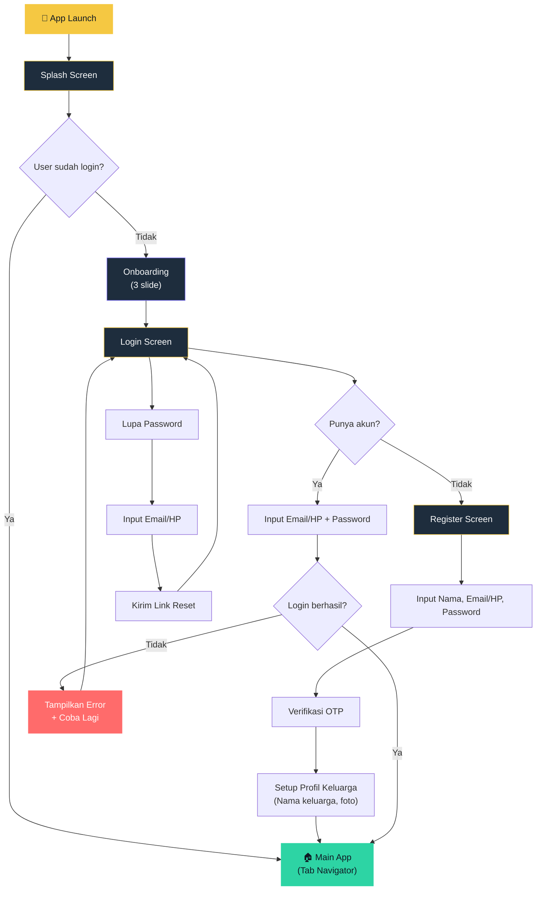
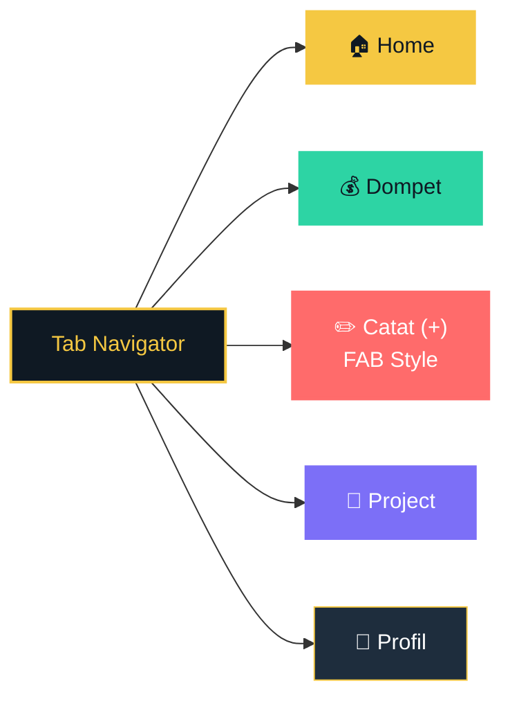
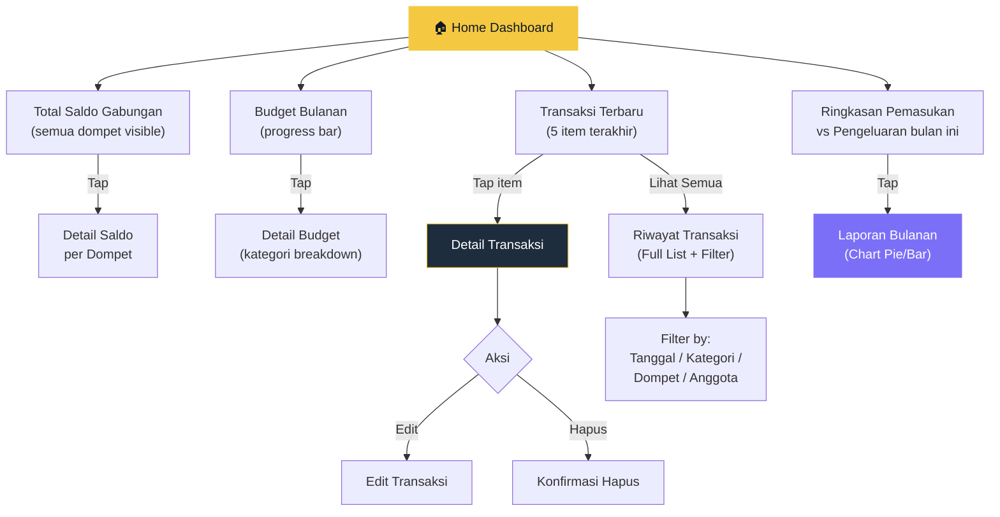
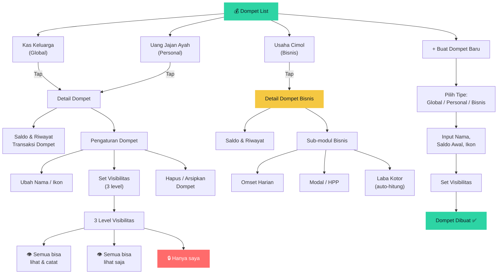
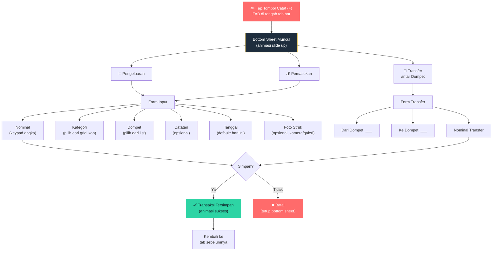
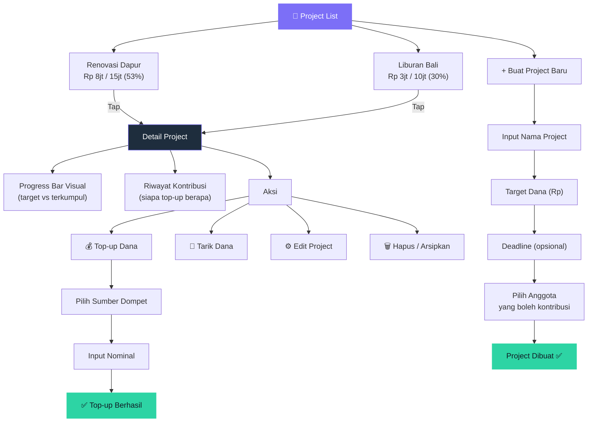
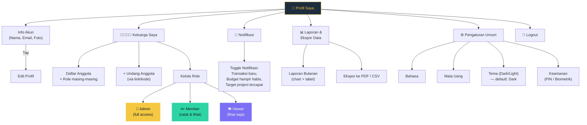

# KasBon App — Navigation Flowchart

Dokumen ini berisi flowchart lengkap navigasi aplikasi KasBon, mulai dari saat pertama kali dibuka hingga seluruh fitur di setiap tab.

---

## 1. Root Flow (App Launch → Main App)

---

## 2. Main Tab Navigator (5 Tab)

---

## 3. Tab 1 — Home (Dashboard)

---

## 4. Tab 2 — Dompet (Wallets)

---

## 5. Tab 3 — Catat (+) (Floating Action Button)

Tombol ini dibuat **menonjol (FAB)** di tengah tab bar, sesuai preferensi.

---

## 6. Tab 4 — Project (Goals / Tabungan Bersama)

---

## 7. Tab 5 — Profil & Pengaturan

---

## 8. Ringkasan Jumlah Screen per Modul

| Modul | Screen | Jumlah |
|-------|--------|--------|
| **Auth** | Splash, Onboarding, Login, Register, OTP, Lupa Password, Setup Keluarga | 7 |
| **Home** | Dashboard, Detail Saldo, Detail Budget, Detail Transaksi, Riwayat Transaksi, Laporan Bulanan | 6 |
| **Dompet** | List, Detail Dompet, Detail Bisnis, Buat Baru, Pengaturan Dompet | 5 |
| **Catat** | Bottom Sheet (Pengeluaran/Pemasukan), Form Transfer, Pilih Kategori | 3 |
| **Project** | List, Detail, Buat Baru, Top-up, Tarik Dana | 5 |
| **Profil** | Profil, Edit Profil, Keluarga, Undang Anggota, Kelola Role, Notifikasi, Laporan, Ekspor, Pengaturan Umum, Keamanan | 10 |
| | | **Total: 36 screen** |

> [!TIP]
> Dari 36 screen, banyak yang bisa menggunakan komponen *reusable* yang sama (misalnya `GlassCard`, `TransactionItem`, `ProgressBar`). Jadi effort sebenarnya lebih ringan dari angka 36.
